# CursorFlow

Move around your mouse with your hand! With the camera!

## sources

Mediapipe code template taken from https://mediapipe.readthedocs.io/en/latest/solutions/hands.html. This seems deprecated, but it still works somehow.

Up-to-date docs seem to exist, with different code, at https://ai.google.dev/edge/mediapipe/solutions/vision/hand_landmarker and https://ai.google.dev/edge/mediapipe/solutions/vision/hand_landmarker/python.

The int-to-joint mappings exist at the above link. Here's the image:

## technical description

The user facing side of the program can be described as a concurrent state machine with 2 state machines.

The first state machine describes the ways your hand interacts with the cursor. Cursor movement is either paused, follows your hand like a mouse, or is moved by your hand like a joystick.

The second state machine controls the first, as well as other actions and settings.

When the program starts, no menus are yet open.

When the user presses `Button 1` (configured in settings), they will open a menu to control clicking. This is a radial menu for left, middle, and right clicking, with a deadzone. Releasing `Button 1` in the dead zone cancels any action. releasing `Button 1` in the left, middle, or right buttons presses that button on the computer. Holding the selection of a button double clicks that button on the computer.

When the user presses `Button 2`, they will open a menu to control miscellaneous actions and settings. This is also a radial menu, and releasing in the dead zone also cancels any actions. Releasing `Button 2` on the pause/resume button, or the mouse/joystick button will toggle those features.

```mermaid
stateDiagram-v2
    Waiting : Waiting (no menus open)
    [*] --> Waiting : Program starts
    Waiting --> ClickMenu : press button 1
    Waiting --> MiscMenu : press button 2
    ClickMenu --> Waiting : finish action
    MiscMenu --> Waiting : finish action

    state ClickMenu {
        CMDeadzone : DZ
        L M R
    }

    state MiscMenu {
        MMenuDeadzone : DZ
        ❚❚/▷ 🖱️/🕹️ ...
    }
```

